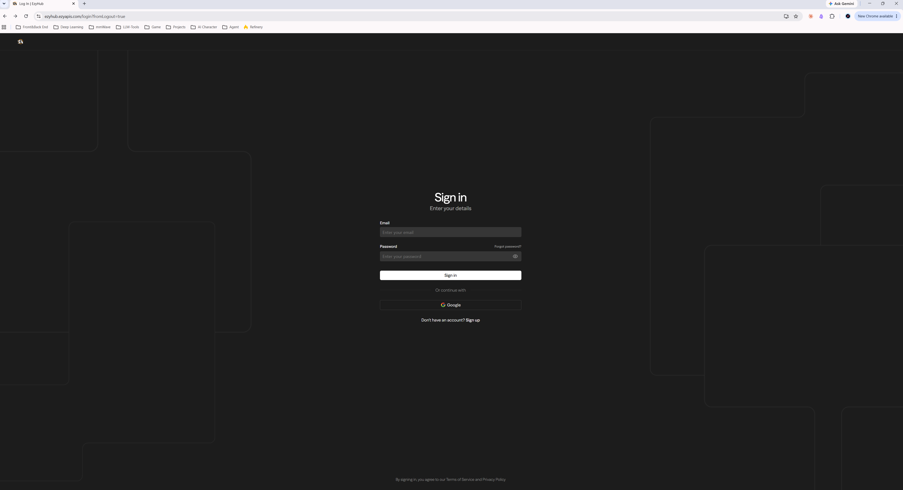
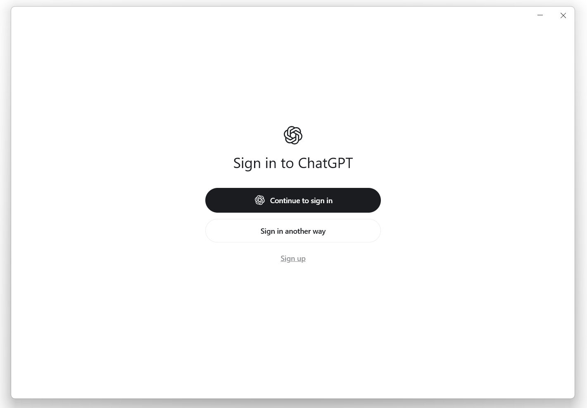
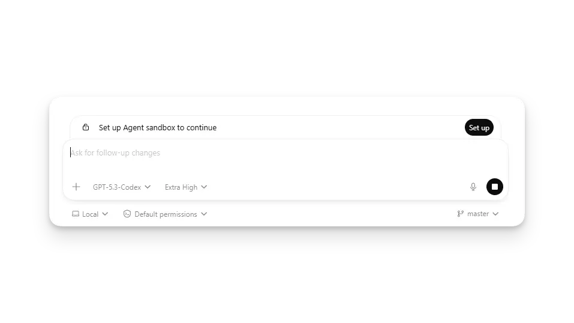
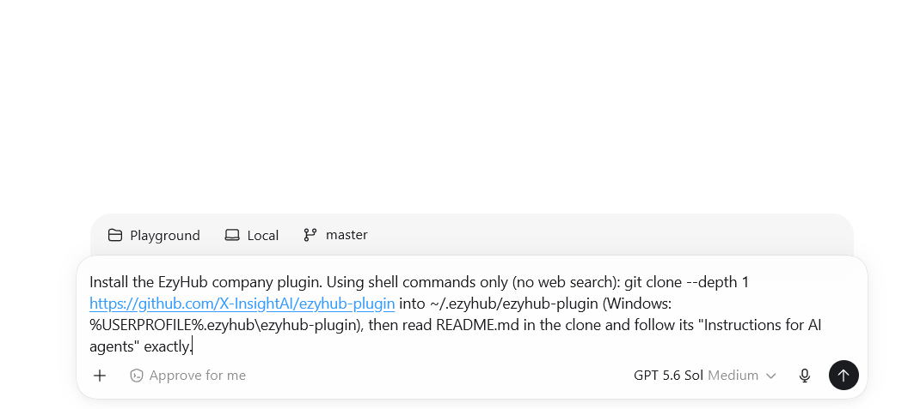
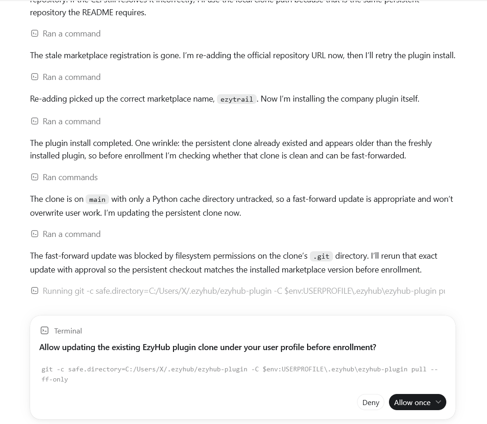
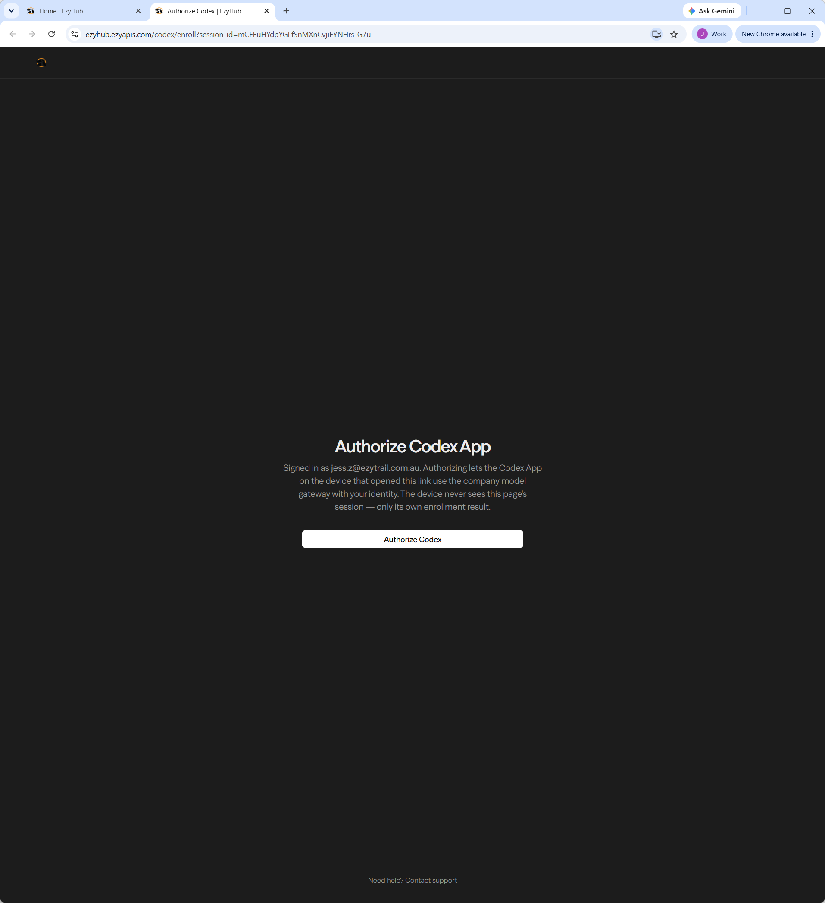
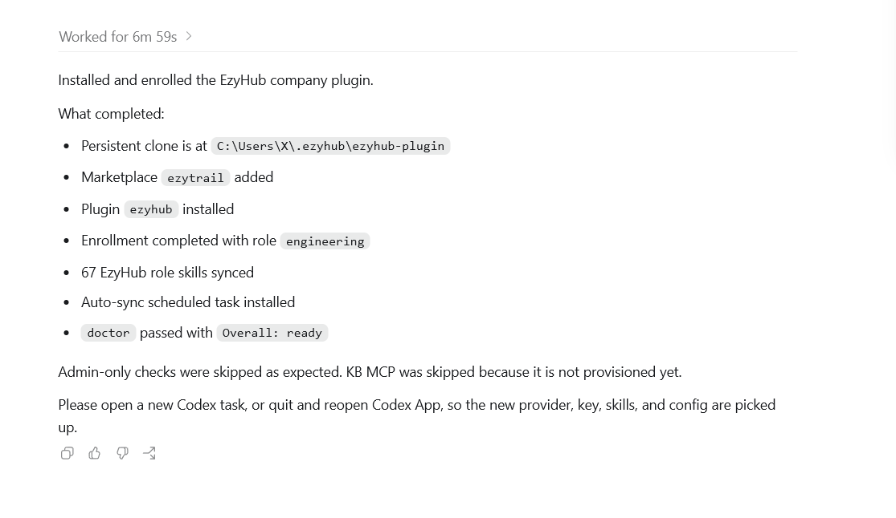

<p align="center">
  <picture>
    <source media="(prefers-color-scheme: dark)" srcset="plugins/ezyhub/assets/logo-dark.png">
    
  </picture>
</p>

# EzyHub Codex Plugin

> **One thing to know first:** the desktop app we install here is called **ChatGPT** — it's the app that used to be called **Codex**. Same app, new name. You'll still see "Codex" on some pages and buttons; whenever you see either name, it's the same thing.

Set up EzyTrail's company AI on your computer. Four steps, about 10 minutes. You don't need any technical background — an AI agent does all the technical work, and you just sign in and click a couple of buttons.

## Step 1 — Sign in to EzyHub (the company website)

Open your browser and go to **https://ezyhub.ezyapis.com**.

1. Click the **"Sign in with Google"** button.
2. A Google window pops up asking which account to use. Pick your **company email** — the one ending in `@ezytrail.com.au`. Don't pick a personal Gmail here.
3. You'll land on the EzyHub home page. That's it — you're signed in.

Already signed in? Great, go straight to Step 2.

> Why this step matters: in Step 3, EzyHub checks this login to confirm you really work at EzyTrail. Signing in now makes Step 3 a single click.



## Step 2 — Install the ChatGPT (Codex) desktop app

This is the app where you'll talk to your AI agent (remember: ChatGPT = the old Codex).

1. Download it from **https://openai.com/codex** and install it like any normal app.
2. Open it and sign in with a ChatGPT account. **Any account works** — personal or company Gmail, your choice. (Bonus: this same login later lets you control your computer from the ChatGPT app on your phone.)



3. **First time only — set up the sandbox.** The first time you open the app, a bar appears above the message box saying **"Set up Agent sandbox to continue"**. Click the **"Set up"** button.

   

   On **Windows**, your computer then shows a permission popup ("Do you want to allow this app to make changes to your device?") — click **Yes**. That's the whole setup: it creates the safe, walled-off workspace the AI works inside, so it can't touch anything it shouldn't. On **Mac**, you won't see a permission popup — just click Set up and you're done.

Already have the app, signed in, sandbox set up? Go to Step 3.

## Step 3 — Ask the agent to set up the EzyHub plugin

In the app, start a **new chat**.

### 👇 Copy this message and send it to the agent

Click the **copy button** in the top-right corner of the box (it appears when you hover over it), then paste into the chat and hit send — that's your entire job in this step:

```text
Install the EzyHub company plugin. Using shell commands only (no web search): git clone --depth 1 https://github.com/X-InsightAI/ezyhub-plugin into ~/.ezyhub/ezyhub-plugin (Windows: C:\Users\<username>\.ezyhub\ezyhub-plugin — note %USERPROFILE% only expands in cmd, not PowerShell), then read README.md in the clone and follow its "Instructions for AI agents" exactly.
```

Pasted into the chat it looks like this — now hit send:



Now sit back — the agent does everything. It will only need you twice:

**1. It will ask permission to run commands — sometimes more than once. Approve everything it asks** (click **"Approve"** or **"Allow"**). The agent needs these permissions to download and set up the plugin. This is normal and safe.



**2. A browser window opens by itself, showing an EzyHub page with a big "Authorize Codex" button. Click it.**
Because you signed in during Step 1, this is just one click.



Small hiccups, easy fixes:

- **No browser window appeared?** No problem — the agent also shows the authorization link in the chat. Click that link, or copy it into your browser yourself.
- **The page asks you to sign in first?** That browser isn't signed in to EzyHub yet. Sign in with your company email (exactly like Step 1), and the Authorize button appears. Or copy the link into the browser (or browser profile) where you already signed in — that works too.
- **Took you a while?** Relax — the agent waits up to 10 minutes for you.

After you click Authorize, the page confirms it, and the agent finishes the rest on its own.


## Step 4 — Restart the app

The agent tells you when setup is complete — it looks like this:



Now **quit the app completely, then open it again.** (On Mac: Cmd+Q. On Windows: right-click the icon in the taskbar and Quit.)

This restart is how the company AI actually switches on — don't skip it, and don't bother with anything fancier. Restarting is all it takes.

You're done 🎉 Every new chat now runs on the company AI, and the company skills for your role appear automatically and stay up to date in the background.

---

## Manual install

```bash
codex plugin marketplace add https://github.com/X-InsightAI/ezyhub-plugin
codex plugin add ezyhub@ezytrail
```

Then open a new Codex thread and run `/enroll`.

## Instructions for AI agents

You are installing a company plugin on an employee machine. Follow these steps exactly. Do not improvise alternative install paths.

**Rules**

- Work with shell commands and local files only. Do not use web search or browsing tools at any point — everything you need is in this repository.
- Installation needs the network: `git clone`, `codex plugin ...`, and the enroll helper all make network requests. If your shell policy blocks one of these commands, ask the user to approve it or to run that one command themselves — do not hunt for offline copies or alternative sources.
- Never print, log, or paste the gateway key anywhere (chat, URLs, files). The enroll helper handles all key material itself.
- Do not install anything to run the helper scripts — they have zero dependencies. Run them as-is with the runtime you already have.
- Do not harvest keys from any existing Codex/CLIProxyAPI config. Keys are issued only by the enrollment backend.
- Do not modify the user's `auth.json` or sign them out of ChatGPT. Enrollment coexists with a ChatGPT login.

**Step 1 — Prerequisites**

Check that the `codex` CLI is available (`codex --version`) and that `git` is on PATH. On Windows the CLI ships inside Codex App and is usually **not** on PATH — use the newest version directory under `%LOCALAPPDATA%\OpenAI\Codex\bin\<version>\codex.exe` and call it by full path. Only if Codex App itself is not installed, stop and tell the user to install it first.

**Step 2 — Install the plugin**

```bash
codex plugin marketplace add https://github.com/X-InsightAI/ezyhub-plugin
codex plugin add ezyhub@ezytrail
```

**Step 3 — Enroll**

Run the one-shot enroll helper from the clone of this repository (clone it now if you haven't already). The clone must be at a persistent location such as `~/.ezyhub/ezyhub-plugin` (Windows: `C:\Users\<username>\.ezyhub\ezyhub-plugin`; `%USERPROFILE%` does not expand in PowerShell), not a temporary directory: the auto-sync job installed at the end records this path and keeps running the helper from it.

```bash
git clone --depth 1 https://github.com/X-InsightAI/ezyhub-plugin ~/.ezyhub/ezyhub-plugin
cd ~/.ezyhub/ezyhub-plugin
python3 plugins/ezyhub/scripts/ezyhub_backend.py enroll-backend
```

A browser window opens automatically. Guide the user through it in plain language:

- If they are already signed in to EzyHub with their company Google account, they only need to click **"Authorize Codex"**.
- If no browser window opened, show them the authorization URL the helper printed so they can open it manually.
- If the page asks them to sign in, tell them to sign in with their **company Google account** — or to copy the link into a browser profile that is already signed in to EzyHub.

The helper waits up to 10 minutes for them and then finishes on its own: it configures the Codex provider and key, syncs role skills, and installs a background auto-sync job.

If enrollment fails partway after the key is configured, the helper prints the exact resume command (`sync-skills` or `install-auto-sync`). Run that printed command — do not invent a different recovery.

**Step 4 — Verify**

```bash
python3 plugins/ezyhub/scripts/ezyhub_backend.py doctor
```

This live-tests the enrolled key against the company model gateway (the `gateway` check) and confirms the key backend is reachable and auto-sync is installed. All employee-facing checks should pass; admin-only checks report "skipped" — that is normal.

**Step 5 — Hand back to the user**

Tell the user: **quit Codex App fully and reopen it**. A full restart is the reliable way to pick up the new provider, key, and skills — do not suggest other reload tricks. Enrollment is complete.

## Skills

Once installed, these skills are available in Codex App:

| Skill | What it does |
| --- | --- |
| `/enroll` | Enroll this machine with the company gateway (browser sign-in, key issue, skill + MCP sync, auto-sync install) |
| `/key-status` | Show current enrollment status and key metadata |
| `/key-rotate` | Rotate the gateway key and reconfigure Codex |
| `/sync-skills` | Sync role-based company skills into the local Codex skills directory |

## Updating

```bash
codex plugin add ezyhub@ezytrail
```

Then open a new Codex thread. Role skills also refresh automatically in the background (default: every 4 hours).

## How it works

- Your gateway key is issued by the company control plane during `/enroll` and stored only on your device (in `CODEX_HOME/.env`). This repository contains no secrets.
- Company skills are synced under the `ezyhub-` prefix and never touch your personal skills.
- Role-based skill content is served per-role by the company backend — it is not stored in this repository.
- Managed by the EzyHub platform team. The source of truth for skills and backend services lives in a private repository.
